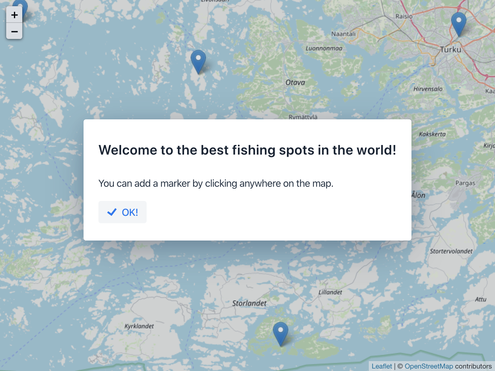

# ⚠️ This repository is deprecated

**An up-to-date example of integrating a JS library (specifically LeafletJS) is available at [start.vaadin.com](https://start.vaadin.com/) (the Map view).**

# Project example for integrating a JS library with Vaadin Flow

This project demonstrates how to integrate a 3rd party JS library (LeafletJS in this case) into a Vaadin application, as a custom web component.

The integration can be found in two files, LeafletMap.java and leaflet-map.js. MainView.java is a Vaadin application that demonstrates how to use the component.

## Running the Application

Import the project to the IDE of your choosing as a Maven project.

Run the application using `mvn spring-boot:run`.

Open http://localhost:8080/ in your browser.

If you want to run the application locally in production mode, run `mvn spring-boot:run -Pproduction`.

